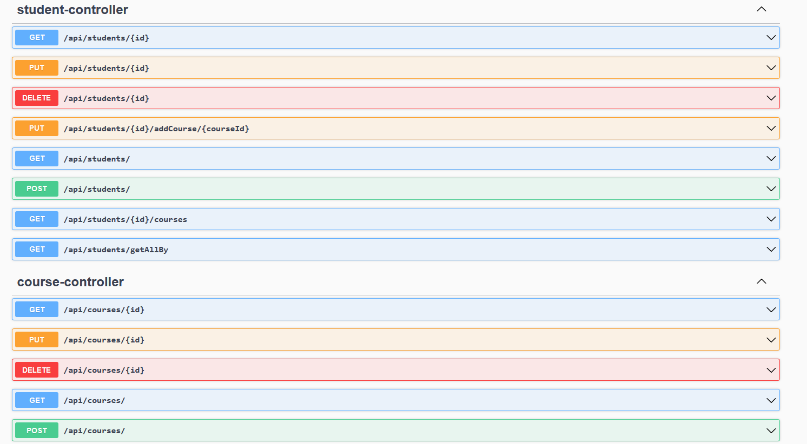

# Lab 2 - RestFUL Web Services

In this lab, I createed a spring boot application from scratch.


## API Documentation


Use Swagger
```
http://localhost:8080/swagger-ui/index.html
```

###  Requirements
---
* Use n-tier software architecture model.
* Make a domain model `Course` with  `id, name, code`.
* Make a domain model `Student` with `id, firstName, lastName, email, major, gpa, and coursesTaken`.
    * A student can take multiple courses.
* Create the repositories for the domain models. 
	* Hold data in array lists.
* Implement CRUD operations for the domains.
 * Implement `getStudentsByMajor(String major)` method.
   * Returns all students majoring `major`.
 * Implement `getCoursesByStudentId(int studentId)` method.
   * Returns all courses of the student.
* Create API documentation with `Swagger`.

